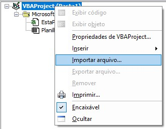
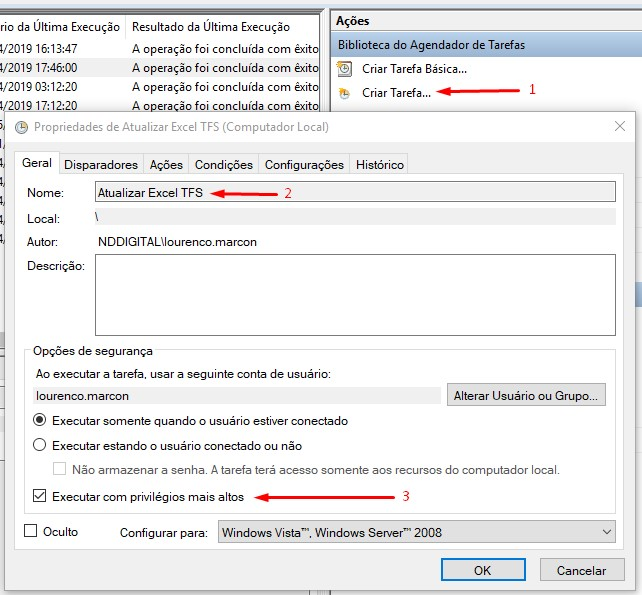
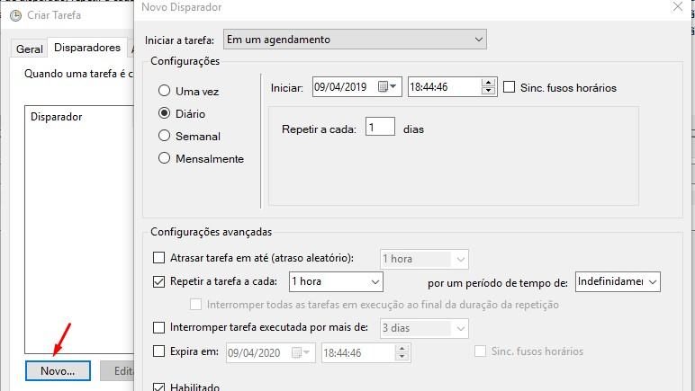
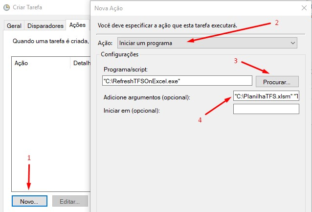

## RefreshTFSOnExcel
Um executável que será responsável por atualizar automaticamente as queries do TFS em uma planilha do Excel
<br/>

#### Um passo a passo de como configurar:

1.	Adicionar a query do TFS na planilha
    * Obs.: poderá ter uma query apenas por aba na planilha

2.	Habilitar a guia Desenvolvedor no excel
    * Na guia arquivo, vá para Opções > Personalizar faixa de opções > Nas Guias Principais, marque a caixa de seleção Desenvolvedor.

3.	Ir no menu Desenvolvedor > Abrir o editor do Visual Basic
<br/>


4.	Fazer  [download do ModuloTFS.bas](https://raw.githubusercontent.com/lourencomarcon/RefreshTFSOnExcel/master/downloads/ModuloTFS.bas) em uma pasta local e no editor importar o arquivo para o projeto.
<br/>


5.	Salvar a planilha com a extensão .xlsm

6.	Agora vamos agendar uma tarefa para que seja o gatilho da execução da atualização.

7.	No agendador de tarefas > Criar uma tarefa > Preencher o nome para a tarefa > Marcar a opção de executar com privilégios mais altos.
<br/>


8.	Criar um disparador, pode ser configurado conforme a necessidade, no exemplo abaixo irá rodar de hora em hora.
<br/>


9.	Criar uma ação para a tarefa > Na aba Ações > Novo > Selecionar a opção Iniciar um programa 
    * Fazer [download do executavel](https://github.com/lourencomarcon/RefreshTFSOnExcel/raw/master/downloads/RefreshTFSOnExcel.exe) em uma pasta local e seleciona-lo
    * Nos argumentos, deverá ser passado dois parâmetros, o caminho da planilha e o nome das abas que possuem as queries, se possuir mais de uma aba, concatenar com ponto e vírgula. Exemplo: "C:\PlanilhaTFS.xlsm" "TFS1; TFS A"
<br/>


10.	Clicar em Ok para salvar a tarefa e aguardar a sua execução.

<br/>

#### Pode ser testado através do Prompt de Comando

```console
RefreshTFSOnExcel.exe "C:\PlanilhaTFS.xlsm" "TFS1; TFS A"
```

<br/>

**Obs.:** No diretório em que está o executável, a cada rotina ele irá logar em um arquivo texto, isso irá facilitar a visibilidade da execução e também para apontar possíveis problemas.
